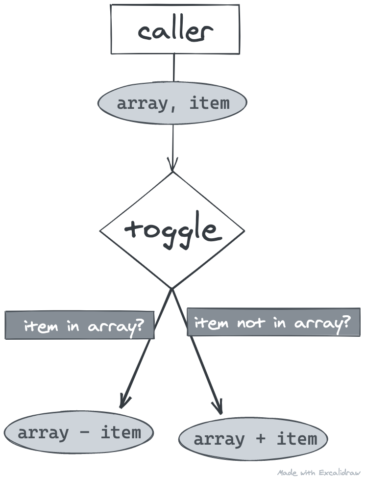

## TL;DR

### Implementation

```jsx
const removeAtIndex = (arr, index) => {
  const copy = [...arr];
  copy.splice(index, 1);
  return copy;
};

const toggle = (arr, item, getValue = item => item) => {
  const index = arr.findIndex(i => getValue(i) === getValue(item));
  if (index === -1) return [...arr, item];
  return removeAtIndex(arr, index);
};
```

### Usage

```jsx
let arr = [1, 2, 3];

arr = toggle(arr, 2); // [1, 3];
arr = toggle(arr, 4); // [1, 3, 4];
```

Read below for explanations or simply for pointless (or not) brain-picking.

## Let's get toggling

Let's go through the basic idea of the function by sketching it out.

So the idea here is having a function called `toggle` that we can call to redefine our array variable.



The caller is whatever piece of code holds your array to begin with. In this piece of code, you want a certain item matching a condition toggled in your array. Basically, if the item is found in the array, it is removed; if it's not found, it's added instead.

We would call it like this:

```jsx
let arr = [1, 2, 3];

arr = toggle(arr, 2); // [1, 3];
arr = toggle(arr, 4); // [1, 3, 4];
```

Now that the concept is understood, let's go through a primary version of the `toggle` function in javascript:

```jsx
const toggle = (arr, item) => {
  if (arr.includes(item)) return remove(arr, item);
  else return add(arr, item);
}
```

Pretty simple. What about the `add` and `remove` functions though?

## Adding an item

Adding an item to an array is a piece of cake. Since we use functional programming here (mutation), and don't want the original array to be altered, let's just return the deconstructed array with the item added to the end of it.

```jsx
return [...arr, item];
```

## Removing an item

Removing an item is a little more complex, but let's keep it simple for now using `filter`.

```jsx
return arr.filter(i => i !== item);
```

Stir it up a little and we now have:

```jsx
const toggle = (arr, item) => {
	if (arr.includes(item)) return arr.filter(i => i !== item);
	else return [...arr, item];
}
```

That's not really just it, though.

## When dealing with objects

One problem that might come up using this implementation is when using an array of objects. Sometimes you might only want to remove the object with a certain `id` for example, regardless of the value of its other fields. `arr.includes` would be no help in that case.

To address this, let's give our functions an optional `getValue` callback function. This callback will return the actual value we want to compare the items with (like a unique `id`). Since it's optional, we'll give a default value of the item, untouched.

```jsx
const toggle = (arr, item, getValue = item => item) => {
  if (arr.some(i => getValue(i) === getValue(item)))
    return arr.filter(i => getValue(i) !== getValue(item));
  else return [...arr, item];
};
```

This gives us the flexibility of giving it a whole function to help compare our array items.

We could now only compare the item `id` by giving it a callback function of `item => item.id`.

```jsx
const object1 = { id: 2, name: "Hello" };
const object2 = { id: 3, name: "Hi" };
let arr = [object1, object2];

arr = toggle(arr, object1, item => item.id);
console.log(arr); // [{ id: 3, name: "Hi" }]
```

By giving it a more complex callback, I can think of a couple more creative use of a function like this. That will be for another day.

For simpler arrays, we could still call it without providing the callback:

```jsx
let arr = [1, 2, 3];

arr = toggle(arr, 2);
console.log(arr); // [1, 3];
```

## Improve performance

The above works, although you might have noticed that we use the comparison with the `getValue` calls twice. That means we loop through **all** the array twice (or almost all thanks to the `some` function). This could get ugly on huge arrays.

Let's reorder this to only loop through the array once.

`arr.filter` gives us back an array that is filtered if an item matching a certain condition was found. It means that if the array comes back untouched after the `filter` call, it couldn't find the item we were looking for.

We can use this to our advantage to replace completely the use of `arr.some` we had before, leaving us with a single loop through our array items.

```jsx
const toggle = (arr, item, getValue = item => item) => {
  const filtered = arr.filter(i => getValue(i) === getValue(item));
  if (arr.length === filtered.length) {
    // array was not filtered; item was not present; then add
    return [...arr, item];
  } else {
    // array was filtered; item was present; then remove
    return filtered;
  }
}
```

Let's clean it up a little as I don't like clutter, and this is small enough to be readable using some of the javascript quirks.

```jsx
const toggle = (arr, item, getValue = item => item) => {
  const filtered = arr.filter(i => getValue(i) === getValue(item));
  return arr.length === filtered.length ? [...arr, item] : filtered;
}
```

## A side effect to note

One side effect of using the `filter` function to remove an item is that it doesn't stop at the first found item that matches the condition given. If the condition given is too permissive, more than one item could be removed.

This could be seen as a benefit. For example, you could have various items with an `id` of `2` in an array, and want to toggle that, so either remove them all or add one.

Most of the time though, you don't want that because it could lead to some unwanted item removals.

To address this, let's use the [splice](https://developer.mozilla.org/en-US/docs/Web/JavaScript/Reference/Global_Objects/Array/splice) function instead to remove the item. Since `splice` works with indexes, we need to find that first. We can do that using `findIndex` in a similar way we used `filter`.

The `findIndex` function will stop at the first element matching the condition given, so it has the side benefit of not looping through the whole array unless the item is at the last index, or simply not found.

Using `findIndex` means we have to one again reorder stuff a little.

For our first condition, we'll use the value returned by (`-1` if not found, `index` if found).

```jsx
const index = arr.findIndex(i => getValue(i) === getValue(item));
if (index === -1) // remove
else // add
```

Then, to remove an item at this index (if not `-1`), we use `splice`.

```jsx
const removeAtIndex = (arr, index) => {
  const copy = [...arr];
  copy.splice(index, 1);
  return copy;
}
```

I created a whole function to keep the `toggle` function as clean as possible, and have great separation of concerns between our utility function set.

Here is what our final `toggle` looks like:

```jsx
const toggle = (arr, item, getValue = item => item) => {
	const index = arr.findIndex(i => getValue(i) === getValue(item));
	if (index === -1) return [...arr, item];
	return removeAtIndex(arr, index);
}
```

The reason we create a copy on the array in the `removeAtIndex` function is to avoid mutation. In other words, it is to avoid altering the original array given to the `toggle` function.
