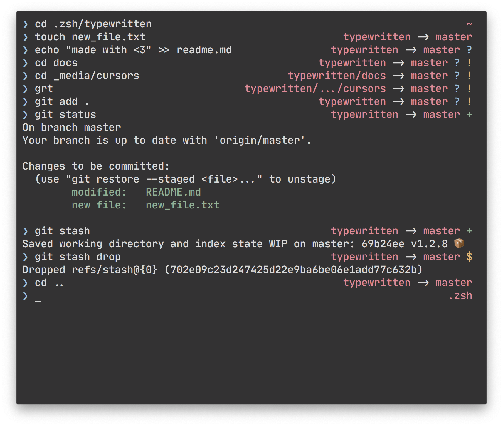

typewritten is a minimal, customizable, and fast zsh prompt.

Actually typing a command is the single most important someone will do on the command line. That's what typewritten focuses on. It leaves all the space for what matters.

The info one might need on the command line is all pushed to the right, and never obstructs the view of the command or its result.

The git info is fetched asynchronously, so it never delays any work.

## Backstory

typewritten started as a very simple `ohmyzsh` theme. I posted it in the external themes list of the `ohmyzsh` wiki. As it started getting more popular, people came up with feature ideas, and ways to restructure the code to make it more simple.

`ohmyzsh` has now been removed as a dependency. typewritten uses pure `zsh` for its display and configuration.

When I created typewritten, I knew next to nothing about shell scripting. Countless hours were spent reading `zsh` and `bash` docs (not the prettiest stuff). I learned along the way.

Credit goes to all of the contributors to typewritten. Some of them pure shell experts, some of them just had great ideas and were there to learn just like me.
