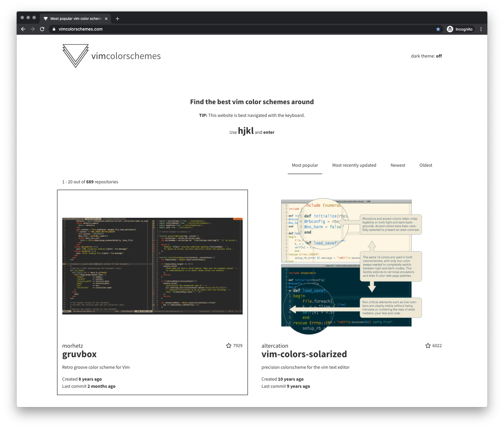

This is vimcolorschemes, the best way to find a new color scheme for your vim setup.

## Backstory

I created vimcolorschemes to solve an old annoyance of mine, which is to find quality, actively maintained, or simply popular vim color schemes for my development environment. The project touches a lot of technologies I absolutely love, and the project as whole is just plain fun to work with.

It is definitely a work in progress, and I have many exciting ideas for the future of vimcolorschemes. Follow [the Roadmap over at GitHub](https://github.com/reobin/vimcolorschemes/projects/4).

## Core mission

In order to become the **ultimate resource** for vim users to find the **perfect color scheme** for their development environment, vimcolorschemes focuses on the following values:

* Content first
* Speed
* Accessibility

## Key features 🚀

- **Daily updated** list of hundreds of vim color scheme repositories
- **Awesome vim (or arrows) key bindings** to navigate quickly through the whole site

## Tech stack

vimcolorschemes uses the following technologies:

- Gatsby
- React
- Python
- MongoDB
- AWS

Below is a basic explanation of how each actor of vimcolorschemes uses these technologies.

### The app

What I call the app is what you see after requesting [vimcolorschemes.com](https://vimcolorschemes.com) in your browser. It is a statically generated website built with [Gatsby](https://gatsbyjs.com). Gatsby is a [React](https://reactjs.org/) framework, which uses JavaScript.

At build time, the app fetches all the repositories from the [MongoDB](https://www.mongodb.com/) database, processes all of their images. Then, Gatsby generates all the files necessary for the website to exist.

When the build is done, all the static files are uploaded to an S3 bucket. Then, AWS CloudFront serves the static files through a distribution, making the website available to visit.

The website is built and deployed everyday in order to hold the most up-to-date data possible.

### The worker

The worker is responsible for all data collection and maintenance. It's a set of python scripts using the same modules in order to keep the data up-to-update and clean. Each script is triggered to run on AWS Lambda once a day.

[Read more on how it works](https://github.com/reobin/vimcolorschemes/wiki/The-Worker)

[See the repository](https://github.com/reobin/vimcolorschemes-worker)
